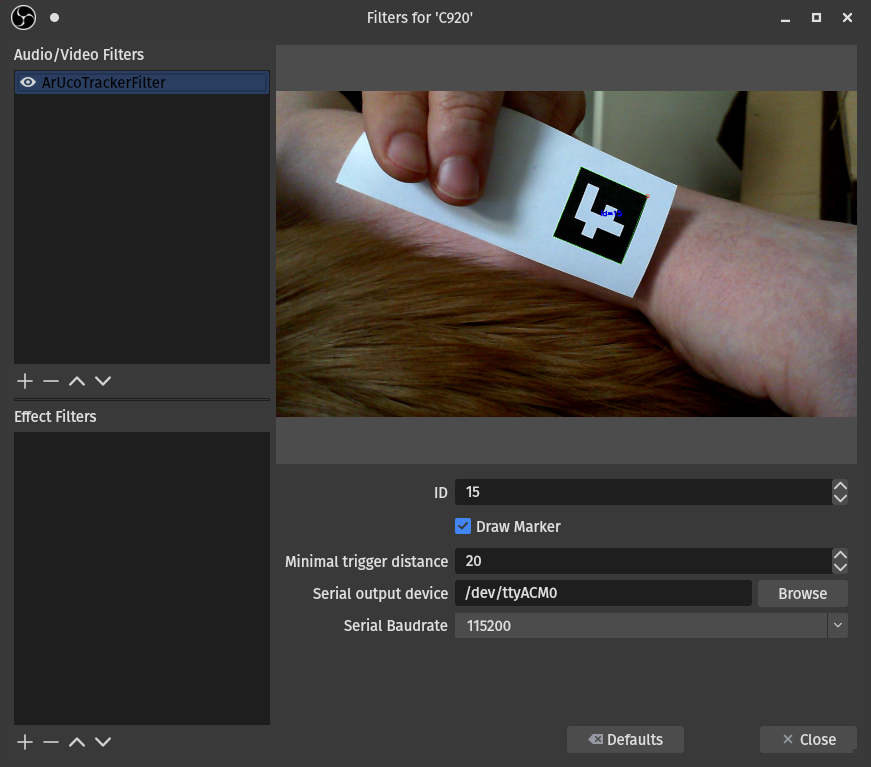

## obs-aruco-tracker

Track ArUco markers and output movement commands to re-center the marker.

### v0.1.0



### MODULES

#### ArUco Tracker Filter

Add to a video source to generate camera gimbal direction output used to re-center the marker.

### REQUIREMENTS

* *obs-studio*
* *openCV 4*

### INSTALLATION

#### For ArchLinux:

Use the included PKGBUILD


#### For installation from source:

```bash
git clone https://github.com/dunkelstern/obs-aruco-tracker
cd obs-aruco-tracker
mkdir build
cd build
cmake .. -DSYSTEM_INSTALL=0
make
make install
```

for local installation or `cmake .. -DSYSTEM_INSTALL=1` for system installation
