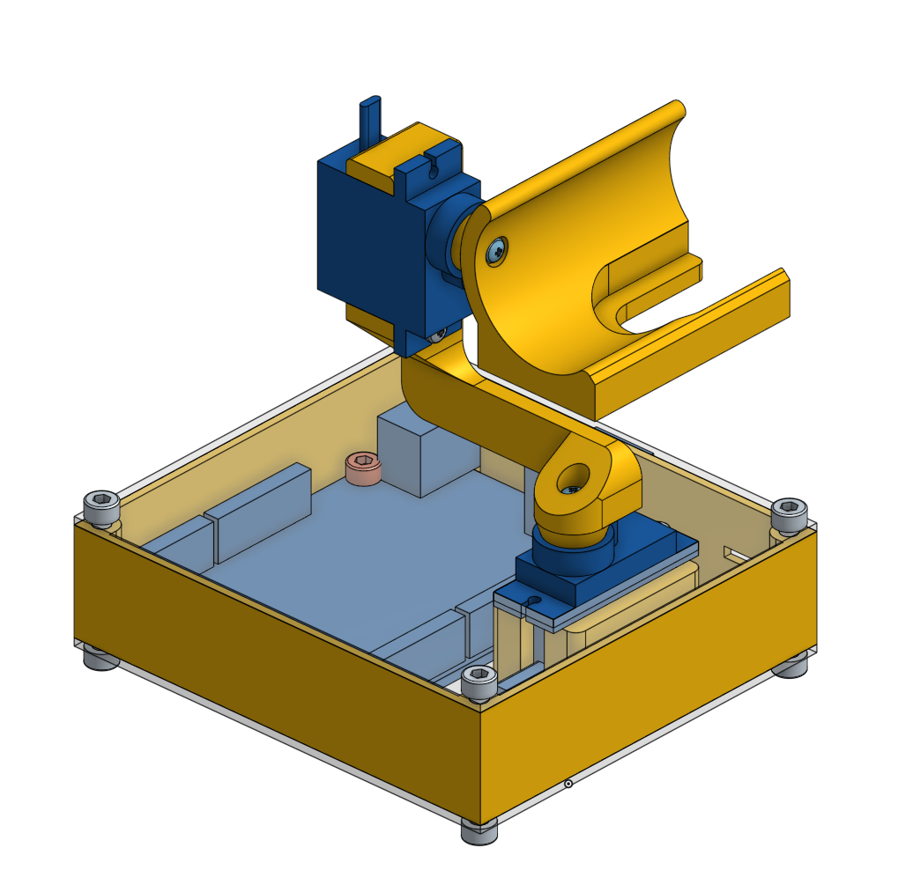

## obs-aruco-tracker

Track ArUco markers and output movement commands to re-center the marker.

### v0.1.0


### MODULES

#### ArUco Tracker Filter

Add to a video source to generate camera gimbal direction output used to re-center the marker.

#### REQUIREMENTS

* *obs-studio*
* *openCV 4*

#### INSTALLATION

##### For ArchLinux:

Use the included PKGBUILD


##### For installation from source:

```bash
git clone https://github.com/dunkelstern/obs-aruco-tracker
cd obs-aruco-tracker
mkdir build
cd build
cmake .. -DSYSTEM_INSTALL=0
make
make install
```

for local installation or `cmake .. -DSYSTEM_INSTALL=1` for system installation

#### Arduino sketch

The Arduino sketch is used for controlling a camera gimbal (nicknamed "Klein Glotzi").

You will need the Library [PWMServo](https://github.com/PaulStoffregen/PWMServo) for the sketch to work.
Before flashing the Sketch make sure that the calibration values are good for your
Servos. (See the Sketch for more information)


#### "Klein Glotzi" Camera gimbal



- The plans for the Gimbal can be seen here: [Klein Glotzi on OnShape CAD](https://cad.onshape.com/documents/6b43bf9158c2330bf8f3274f/w/bf932df38055a7275eddfee5/e/89a3396a8a0f5c6514141639)
- The STL Files for 3D-Printing the gimbal are in the STL Subfolder.
- In addition to an Arduino Uno (or Nano) you will need some wires and two Tower SG90 Micro Servos.
- The Gimbal mount is built for a MS Lifecam, so you probably want one of those too.